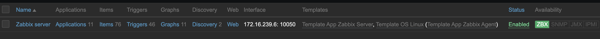

# Docker-Zabbix

- [GitHub/zabbix-docker](https://github.com/zabbix/zabbix-docker)
- 2020/12/03


## Zabbix Server

直接使用官網提供的 zabbix-docker 來使用

```bash
git checkout 4.0.0
docker-compose -f docker-compose_v3_centos_mysql_latest.yaml up -d
```

服務就成功 on 起來了. 但是, Zabbix Server 監控自身所配置的 Zabbix Agent 寫的是 localhost

應改為 Zabbix Agent 的 IP, 所以底下分為兩步驟來修改:

##### Step1. 修改 Web 介面內的配置

`docker inspect zabbix-docker_zabbix-agent_1`

- 找出對應的 IP 後, 修改 Zabbix Server 接收資料的 *Agent interface*
    - http://localhost:8081
    - Configuration > Hosts > Zabbix server, 修改 *Agent interfaces*


##### Step2. Zabbix Server 重載 Config

`docker exec -it zabbix-docker_zabbix-server_1 zabbix_server -R config_cache_reload`

- 之後大約要過個幾十秒, 就能看到 Availability 底下的 `ZBX` 亮綠燈了!!



------------------------


## Zabbix Agent

**底下使用性尚未驗證**

```bash
docker pull zabbix/zabbix-agent:centos-4.0-latest

docker run --name zab-agent \
    -e ZBX_HOSTNAME="zabbix_agent" \
    -e ZBX_SERVER_HOST="zabbix_server" \
    -d zabbix/zabbix-agent:centos-4.0-latest
# -v 外頭, 先準備好一份 Agent Config
# ZBX_HOSTNAME: Container hostname ; 設定檔的 Hostname
# ZBX_SERVER_HOST(default: zabbix-server): Zabbix Server/Proxy 的 IP or DNS. 設定檔的 Server

### firewall
$# firewall-cmd --add-port=7777/tcp
$# firewall-cmd --add-port=7778/tcp


### 查看 log
$# docker logs zabbix_server

### 版本
$# zabbix_server --version
zabbix_server (Zabbix) 4.2.4
Revision 059af02 26 June 2019, compilation time: Jul 18 2019 12:41:59

Copyright (C) 2019 Zabbix SIA
License GPLv2+: GNU GPL version 2 or later <http://gnu.org/licenses/gpl.html>.
This is free software: you are free to change and redistribute it according to
the license. There is NO WARRANTY, to the extent permitted by law.

This product includes software developed by the OpenSSL Project
for use in the OpenSSL Toolkit (http://www.openssl.org/).

Compiled with OpenSSL 1.1.1c  28 May 2019
Running with OpenSSL 1.1.1c  28 May 2019
```