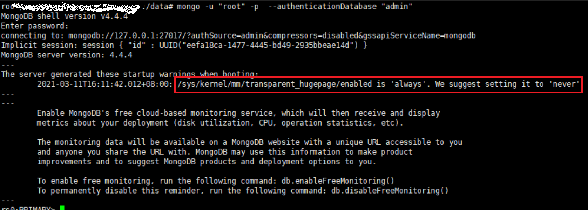

# [Disable Transparent Huge Pages (THP)](https://docs.mongodb.com/v4.4/tutorial/transparent-huge-pages/)




## THP(Transparent Huge Pages, 透明大頁面) 觀念

- 實務上, THP 啟用時, DB 負載通常表現不佳 (cause they tend to have sparse rather than coutigous memory access patterns)
- THP 是一種 Linux 記憶體管理系統. 藉由使用較大的 memory page 來處理大量內存, 進而減少減少 Translation Lookaside Buffer(TLB) 查找開銷


## 關閉 THP 流程

- 關於關閉 THP, 應該在 Host Level 去做關閉(非 Container 或 MongoDB Config)
    - 這個 Issue 可參考 [applying production notes recommendation](https://github.com/docker-library/mongo/issues/112)
- RHEL/CentOS 需要額外做一件事情, 必須額外聲明一份文件, 讓 Kernel 不去使用 `ktune` 或 `tuned`


## Step1

```bash
### CentOS: 
cat <<EOF > /etc/systemd/system/disable-transparent-huge-pages.service
[Unit]
Description=Disable Transparent Huge Pages (THP)
DefaultDependencies=no
After=sysinit.target local-fs.target
Before=mongod.service

[Service]
Type=oneshot
# v4.2+
ExecStart=/bin/sh -c 'echo never | tee /sys/kernel/mm/transparent_hugepage/enabled > /dev/null'
# v4.2前(含)
#ExecStart=/bin/sh -c 'echo never | tee /sys/kernel/mm/transparent_hugepage/defrag > /dev/null'

[Install]
WantedBy=basic.target
EOF


systemctl daemon-reload
systemctl start disable-transparent-huge-pages
systemctl enable disable-transparent-huge-pages

### 關閉 THP 以後, 務必做底下的確認:
cat /sys/kernel/mm/transparent_hugepage/enabled
# 預設是        「[always] madvise never」
# 作業目標應變成 「always madvise [never]」
```

## Step2

若為 CentOS/Redhat 才做, 以下為 CentOS7+ 作法

底下只是一個範例, 並非完整 solution, 實際情況應依照系統環境還做配置

```bash
### Create a new directory to hold the custom tuned profile. This example inherits from the existing virtual-guest profile, and uses virtual-guest-no-thp as the new profile:
mkdir -p /etc/tuned/virtual-guest-no-thp
cat <<EOF > /etc/tuned/virtual-guest-no-thp/tuned.conf
[main]
include=virtual-guest

[vm]
transparent_hugepages=never
EOF
# ↑ 不是很懂... 遇到再說

### 套用配置
sudo tuned-adm profile virtual-guest-no-thp
```


