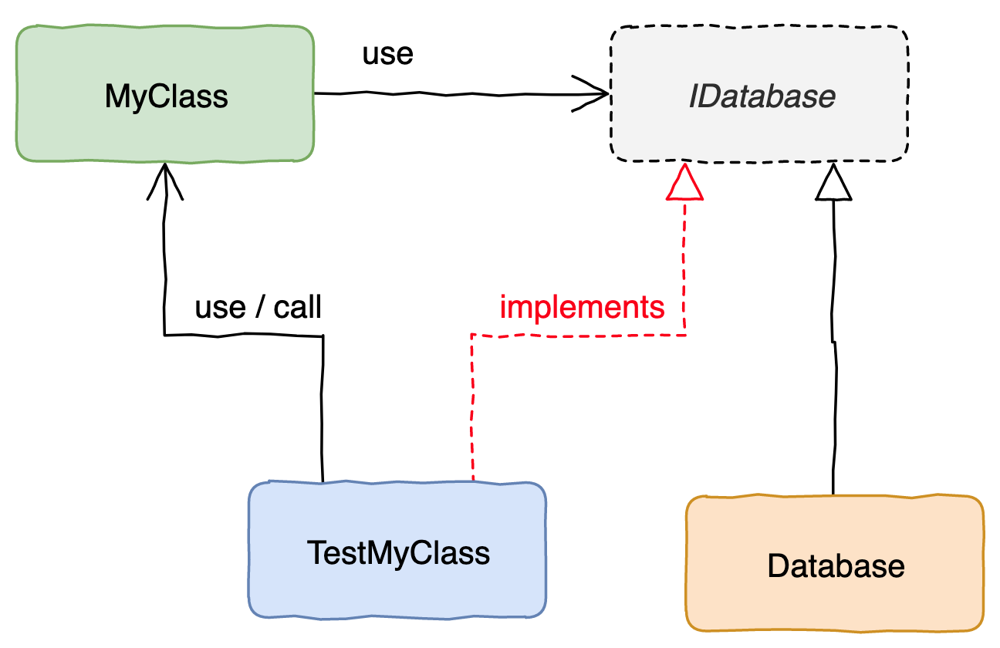

# Mock Testing

Mock test is a trick to shorten development feedback loop.

圖1

在撰寫 Unit Test 時, 會希望把 一個模組(MyClass) 與 它所使用的模組(IDatabase) 區隔開來, 以利 Unit Test 可以單獨測試 A 的行為

圖2

- `MyClass` 透過 `getDbFactory()` 取得 `ConcreteDbFactory`, `TestMyClass` 實作了 `IDbFactory`, 並把 `getDbFactory()` 設置成 **對自己的參考**