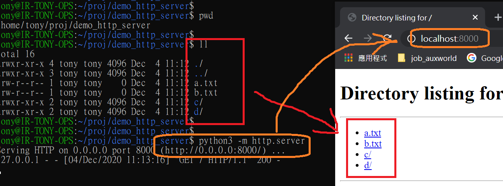

# http.server

- [http.server](https://docs.python.org/3/library/http.server.html)
- 2020/12/04
- 不要在生產環境使用


```bash
### 直接建立共享網頁介面
$ python3 -m http.server
Serving HTTP on 0.0.0.0 port 8000 (http://0.0.0.0:8000/) ...
```

