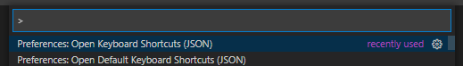

- 2021/02/14
- v1.53.0

> Ctrl + shift + p



```js
// Place your key bindings in this file to override the defaults
[
    { // IntelliSence
        "key": "ctrl+i",
        "command": "editor.action.triggerSuggest",
        "when": "editorHasCompletionItemProvider && textInputFocus && !editorReadonly"
    },
    { // Current Line
        "key": "ctrl+l",
        "command": "expandLineSelection",
        "when": "textInputFocus"
    },
    { // Toggle Mini Map
        "key": "ctrl+m",
        "command": "editor.action.toggleMinimap"
    },
    { // Append New Terminal
        "key": "ctrl+shift+i",
        "command": "workbench.action.terminal.newInActiveWorkspace",
        "when": "terminalFocus"
    },
    { // Next Terminal
        "key": "ctrl+shift+j",
        "command": "workbench.action.terminal.focusNext",
        "when": "terminalFocus"
    },
    { // Previous Terminal
        "key": "ctrl+shift+k",
        "command": "workbench.action.terminal.focusPrevious",
        "when": "terminalFocus"
    }
]
```